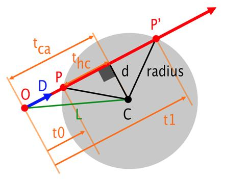
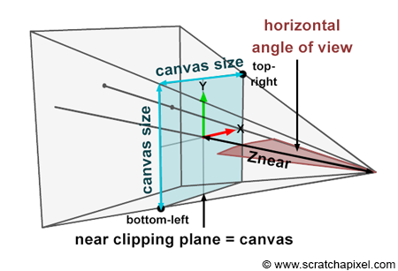

# miniRT — The Mathematics You Actually Need

> A practical math guide for the **42 miniRT** project.  
> The goal is not to teach all of mathematics. The goal is to give you the algebra, geometry, trigonometry, vectors, and equations you need to understand and implement a ray tracer.

---

## Table of Contents

1. [What Mathematics Does miniRT Need?](#1-what-mathematics-does-minirt-need)
2. [Numbers, Variables, and Rearranging Equations](#2-numbers-variables-and-rearranging-equations)
3. [Coordinate Systems](#3-coordinate-systems)
4. [Points and Vectors](#4-points-and-vectors)
5. [Vector Length — Magnitude](#5-vector-length--magnitude)
6. [Normalization](#6-normalization)
7. [Vector Addition and Subtraction](#7-vector-addition-and-subtraction)
8. [Scalar Multiplication and Division](#8-scalar-multiplication-and-division)
9. [Dot Product](#9-dot-product)
10. [Cross Product](#10-cross-product)
11. [Angles and Degrees/Radians](#11-angles-and-degreesradians)
12. [Sine, Cosine, and Tangent](#12-sine-cosine-and-tangent)
13. [The Ray Equation](#13-the-ray-equation)
14. [Ray + Plane](#14-ray--plane)
15. [Ray + Sphere](#15-ray--sphere)
16. [Quadratic Equations and the Discriminant](#16-quadratic-equations-and-the-discriminant)
17. [Ray + Cylinder](#17-ray--cylinder)
18. [Cylinder Caps](#18-cylinder-caps)
19. [Normals](#19-normals)
20. [Camera Mathematics](#20-camera-mathematics)
21. [Field of View](#21-field-of-view)
22. [Viewport](#22-viewport)
23. [Pixel Coordinates](#23-pixel-coordinates)
24. [Building a Camera Coordinate System](#24-building-a-camera-coordinate-system)
25. [Lighting Mathematics](#25-lighting-mathematics)
26. [Reflection](#26-reflection)
27. [Floating-Point Precision](#27-floating-point-precision)
28. [Common miniRT Formulas](#28-common-minirt-formulas)
29. [How the Mathematics Connects](#29-how-the-mathematics-connects)
30. [What was discussed](#30-what-was-discussed)
31. [Summary](#final-summary)

---

# 1. What Mathematics Does miniRT Need?

miniRT is mainly an application of **3D analytic geometry**.

You do not need advanced mathematics such as calculus, differential equations, or linear algebra at university level.

You mainly need:

- Basic algebra
- Cartesian coordinates
- 2D/3D geometry
- Pythagorean theorem
- Trigonometry
- Vectors
- Dot product
- Cross product
- Equations of lines
- Quadratic equations
- Planes
- Sphere equations
- Cylinder equations
- Normals
- Basic reflection
- Basic numerical approximation

The most important idea is:

> A ray tracer turns geometry into equations, solves those equations, and uses the result to decide what each pixel sees.

---

# 2. Numbers, Variables, and Rearranging Equations

Before vectors and geometry, you need to be comfortable with ordinary algebra.

## 2.1 Variables

A variable represents a value.

```text
x = 5
y = 10
```

Then:

```text
x + y = 15
```

In miniRT, variables are everywhere:

```c
double t;
double discriminant;
double denominator;
```

---

## 2.2 Multiplication

```text
2x
```

means:

```text
2 * x
```

For example:

```text
2x = 10
```

Divide both sides by 2:

```text
x = 5
```

---

## 2.3 Moving Terms

Suppose:

```text
x + 5 = 12
```

Subtract 5 from both sides:

```text
x = 7
```

Suppose:

```text
x - 4 = 10
```

Add 4:

```text
x = 14
```

---

## 2.4 Division

```text
x / 5 = 3
```

Multiply both sides by 5:

```text
x = 15
```

---

## 2.5 Square

```text
x² = x * x
```

Examples:

```text
3² = 9
(-3)² = 9
```

Notice:

```text
(-3)² = 9
```

because:

```text
(-3) * (-3) = 9
```

---

## 2.6 Square Root

The square root asks:

> Which number multiplied by itself gives this number?

```text
√25 = 5
```

because:

```text
5 * 5 = 25
```

In C:

```c
sqrt(25.0);
```

requires:

```c
#include <math.h>
```

---

# 3. Coordinate Systems

miniRT works in **3D space**.

A point has three coordinates:

```text
(x, y, z)
```

Example:

```text
P = (2, 3, -5)
```

means:

```text
x = 2
y = 3
z = -5
```

A common coordinate system is:

```text
       +Y
        |
        |
        +-------- +X
       /
      /
    +Z
```

The exact visual orientation depends on your camera convention, but mathematically the three axes are independent.

---

## 3.1 Origin

The origin is:

```text
O = (0, 0, 0)
```

---

## 3.2 Distance Along One Axis

If:

```text
A = 2
B = 7
```

then the distance is:

```text
|7 - 2| = 5
```

The absolute value removes the sign.

---

# 4. Points and Vectors

This is one of the most important concepts in miniRT.

## Point

A point represents a **location**.

Example:

```text
P = (3, 2, -4)
```

## Vector

A vector represents a **direction and magnitude**.

Example:

```text
V = (1, 0, -1)
```

You should mentally think:

```text
Point  -> Where?
Vector -> Which direction? How far?
```

---

## 4.1 Point - Point = Vector

Suppose:

```text
A = (1, 2, 3)
B = (4, 6, 8)
```

Then:

```text
B - A
```

is:

```text
(4 - 1,
 6 - 2,
 8 - 3)
```

Therefore:

```text
B - A = (3, 4, 5)
```

This vector points from A toward B.

This operation is extremely important for:

```text
ray direction
light direction
camera direction
normal direction
```

---

## 4.2 Point + Vector = Point

Suppose:

```text
P = (1, 2, 3)
V = (4, 5, 6)
```

Then:

```text
P + V = (5, 7, 9)
```

You moved point P by vector V.

---

# 5. Vector Length — Magnitude

The length of a vector is called its **magnitude**.

For:

```text
V = (x, y, z)
```

the magnitude is:

```text
|V| = √(x² + y² + z²)
```

Example:

```text
V = (3, 4, 0)
```

Then:

```text
|V| = √(3² + 4² + 0²)
     = √(9 + 16)
     = √25
     = 5
```

This is the 3D version of the Pythagorean theorem.

It is used to determine the shortest distance between two points.

---

## C implementation

```c
double vec_length(t_vec v)
{
    return (sqrt(v.x * v.x
               + v.y * v.y
               + v.z * v.z));
}
```

---

# 6. Normalization

Normalization means:

> Keep the direction but change the vector's length to 1.

For:

```text
V = (x, y, z)
```

first calculate:

```text
length = |V|
```

Then:

```text
V_normalized = V / |V|
```

or:

```text
V_normalized =
(
    x / |V|,
    y / |V|,
    z / |V|
)
```

---

## Example

```text
V = (3, 4, 0)
```

Length:

```text
|V| = 5
```

Normalized:

```text
V = (3/5, 4/5, 0)
```

Therefore:

```text
V = (0.6, 0.8, 0)
```

Its length is now:

```text
√(0.6² + 0.8²)
= √(0.36 + 0.64)
= √1
= 1
```

---

## Why normalize?

miniRT frequently needs directions of length 1.

Examples:

```text
ray direction
surface normal
light direction
camera basis vectors
reflection direction
```

---

# 7. Vector Addition and Subtraction

Vectors are added component by component.

```text
A = (1, 2, 3)
B = (4, 5, 6)
```

Addition:

```text
A + B = (5, 7, 9)
```

Subtraction:

```text
A - B = (-3, -3, -3)
```

In C:

```c
t_vec vec_add(t_vec a, t_vec b)
{
    return ((t_vec){
        a.x + b.x,
        a.y + b.y,
        a.z + b.z
    });
}
```

---

# 8. Scalar Multiplication and Division

A scalar is just a normal number.

Example:

```text
V = (1, 2, 3)
```

Multiply by 5:

```text
5V = (5, 10, 15)
```

Divide by 2:

```text
V / 2 = (0.5, 1, 1.5)
```

---

## Why is this important?

Ray equations use:

```text
origin + direction * t
```

and camera calculations use things such as:

```text
right * viewport_width
up * viewport_height
```

---

# 9. Dot Product

The dot product is one of the most important operations in ray tracing.

For:

```text
A = (Ax, Ay, Az)
B = (Bx, By, Bz)
```

the dot product is:

```text
A · B =
AxBx + AyBy + AzBz
```

Example:

```text
A = (1, 2, 3)
B = (4, 5, 6)
```

Then:

```text
A · B
= 1*4 + 2*5 + 3*6
= 4 + 10 + 18
= 32
```

---

## 9.1 Dot Product and Angles

There is another important formula:

```text
A · B = |A| |B| cos(θ)
```

If A and B are normalized:

```text
|A| = 1
|B| = 1
```

therefore:

```text
A · B = cos(θ)
```

If A and B are not normalized:

```text
cos(θ)=∣A∣∣B∣/A⋅B
```


This makes the dot product extremely useful for determining angles.

This equation tells us that the Dot Product depends on the angle between the two vectors, which is why we use it in miniRT to determine how much light is facing the surface and therefore the intensity of the illumination.

---

## 9.2 Meaning of the Sign

For normalized vectors:

```text
A · B > 0
```

means the angle is less than 90°.

```text
A · B = 0
```

means they are perpendicular.

```text
A · B < 0
```

means the angle is greater than 90°.

---

## 9.3 Lighting

Suppose:

```text
N = surface normal
L = direction toward light
```

Then:

```text
N · L
```
Since we often perform normalization on vectors:

```text
|N| = |L| = 1
```
then

```text
N · L = cos(θ)
```

tells us how directly the light hits the surface.

If:

```text
N · L = 1

N-->
L-->
```

the light hits directly.

If:

```text
N · L = 0
  ^
L |
N  -->
```

the light is sideways.

If:

```text
N · L < 0
```
Here the angle is greater than 90

the light is behind the surface.

A common diffuse lighting calculation is:

```text
brightness = max(0, N · L)
```
That is, if the result is negative, we convert it to zero.

---

# 10. Cross Product

The cross product is another essential 3D operation.

For:

```text
A = (Ax, Ay, Az)
B = (Bx, By, Bz)
```

the cross product is:

```text
A × B =
(
    Ay*Bz - Az*By,
    Az*Bx - Ax*Bz,
    Ax*By - Ay*Bx
)
```

The result is a vector perpendicular to both A and B.

---

## Example

```text
A = (1, 0, 0)
B = (0, 1, 0)
```

Then:

```text
A × B = (0, 0, 1)
```

So:

```text
X × Y = Z
```

---

## Why miniRT needs cross product

The camera needs three perpendicular directions:

```text
forward
right
up
```

For example:

```text
right = normalize(cross(world_up, forward))
up    = normalize(cross(forward, right))
```

This creates an orthogonal camera basis.

---

# 11. Angles and Degrees/Radians

miniRT input commonly gives angles in degrees.

Example:

```text
FOV = 60°
```

But C's trigonometric functions use **radians**.

Conversion:

```text
radians = degrees × π / 180
```

Therefore:

```text
60° = 60 × π / 180
   = π / 3
```

Approximately:

```text
1.04719755 radians
```

---

## Reverse conversion

```text
degrees = radians × 180 / π
```

---

## Important constants

```text
π ≈ 3.141592653589793
```

In C you may use:

```c
#define PI 3.14159265358979323846
```

---

# 12. Sine, Cosine, and Tangent

These are the main trigonometric functions you need.

For a right triangle:

```text
             /|
            / |
           /  | opposite
          /   |
         /θ___|
          adjacent
```

The definitions are:

```text
sin(θ) = opposite / hypotenuse

cos(θ) = adjacent / hypotenuse

tan(θ) = opposite / adjacent
```

---

## Why miniRT uses them

You will mainly use:

```text
tan()
```

for the camera's field of view.

You may also encounter:

```text
cos()
```

when working with angles and lighting.

---

## C

```c
sin(angle);
cos(angle);
tan(angle);
```

All expect radians.

Include:

```c
#include <math.h>
```

---

# 13. The Ray Equation

This is probably the single most important equation in miniRT.

A ray is defined by:

```text
Origin
Direction
```

Mathematically:

```text
R(t) = O + tD
```

where:

```text
R(t) = point on the ray
O    = ray origin
D    = ray direction
t    = distance parameter
```

---

## Example

Suppose:

```text
O = (0, 0, 0)
D = (1, 2, 0)
```

Then:

```text
R(t) = (0,0,0) + t(1,2,0)
```

For:

```text
t = 0
```

we get:

```text
R(0) = (0,0,0)
```

For:

```text
t = 1
```

we get:

```text
R(1) = (1,2,0)
```

For:

```text
t = 2
```

we get:

```text
R(2) = (2,4,0)
```

So t moves you along the ray.

---

## In C

```c
t_point ray_at(t_ray ray, double t)
{
    return (point_add(
        ray.origin,
        vec_scale(ray.direction, t)
    ));
}
```

---

# 14. Ray + Plane

A plane can be described using:

```text
Point P0
Normal N
```

A point P lies on the plane when:

Vector from P0 to P

Perpendicular to the Plane:

Dot Product between two orthogonal vectors = 0

```text
(P - P0) · N = 0
```

This equation is extremely important.

---

## Ray-plane intersection

Ray:

```text
R(t) = O + tD
```

Plane:

```text
(P - P0) · N = 0
```

Substitute the ray into the plane:

```text
(O + tD - P0) · N = 0
```

Expand:

```text
(O - P0) · N + t(D · N) = 0
```

Solve for t:

```text
t(D · N) = -(O - P0) · N
```

Therefore:

```text
t = ((P0 - O) · N) / (D · N)
```

---

## Important case

If:

```text
D · N = 0
```

then the ray is parallel to the plane.

There is no normal intersection.

In code:

```c
denom = vec_dot(ray.direction, plane.normal);

if (fabs(denom) < EPSILON)
    return (false);
```

---

# 15. Ray + Sphere
This is one of the most important calculations in miniRT.

A sphere is defined by:

```text
Center C
Radius r
```

A point P is on the sphere when:

```text
|P - C|² = r²
```

---

## 15.1 Start with the ray




```text
P = O + tD
```

Substitute:

```text
|O + tD - C|² = r²
```

Define:

```text
OC = O - C
```

Then:

```text
|OC + tD|² = r²
```

Using the dot product:

```text
(OC + tD) · (OC + tD) = r²
```

Expand:

```text
OC·OC + 2t(OC·D) + t²(D·D) = r²
```

Rearrange:

```text
(D·D)t²
+ 2(OC·D)t
+ (OC·OC - r²)
= 0
```

This is a quadratic equation:

```text
at² + bt + c = 0
```

where:

```text
a = D·D
b = 2(OC·D)
c = OC·OC - r²
```

---

# 16. Quadratic Equations and the Discriminant

A quadratic equation has the form:

```text
ax² + bx + c = 0
```

The solution is:

```text
x = (-b ± √Δ) / (2a)
```

where the discriminant is:

```text
Δ = b² - 4ac
```

---

## 16.1 What does Δ mean?

If:

```text
Δ < 0
```

there are no real solutions.

For ray tracing:

```text
ray misses sphere
```

If:

```text
Δ = 0
```

there is one solution.

Geometrically:

```text
ray touches sphere
```

If:

```text
Δ > 0
```

there are two solutions.

Geometrically:

```text
ray enters sphere
ray exits sphere
```

---

## 16.2 Sphere intersection

Calculate:

```text
Δ = b² - 4ac
```

If:

```text
Δ < 0
```

return no hit.

Otherwise:

```text
t1 = (-b - √Δ) / (2a)

t2 = (-b + √Δ) / (2a)
```

Usually:

```text
t1 < t2
```

The closest valid intersection is generally the smallest positive t.

---

## 16.3 Why two t values?

Imagine:

```text
             sphere
          .-----------.
        .'             '.
ray --->      ----->     ---->
        '.             .'
          '-----------'
```

The ray enters at:

```text
t1
```

and exits at:

```text
t2
```

---

# 17. Ray + Cylinder

For an infinite cylinder, you need:

```text
Center point C
Axis direction A
Radius r
```

The axis direction should normally be normalized:

```text
|A| = 1
```

For a point P on the cylinder, remove the component along the axis.

First:

```text
V = P - C
```

Projection on axis:

```text
proj = V · A
```

The perpendicular component is:

```text
V_perp = V - A(proj)
```

The point is on the cylinder when:

```text
|V_perp|² = r²
```

Therefore:

```text
|V - A(V·A)|² = r²
```

---

## 17.1 Substitute the ray

Ray:

```text
P = O + tD
```

Therefore:

```text
V = O + tD - C
```

Let:

```text
CO = O - C
```

Then:

```text
V = CO + tD
```

We need:

```text
|V - A(V·A)|² = r²
```

This eventually becomes:

```text
at² + bt + c = 0
```

where:

```text
a = D·D - (D·A)²

b = 2(D·CO - (D·A)(CO·A))

c = CO·CO - (CO·A)² - r²
```

Then use the quadratic formula.

---

## 17.2 Why projection appears?

The cylinder has an axis.

We do not care how far the point is along the axis.

We only care about the distance from the axis.

The projection:

```text
V·A
```

tells us the component along the axis.

Removing it:

```text
V - A(V·A)
```

leaves only the perpendicular component.

That perpendicular component determines the cylinder radius.

---

# 18. Cylinder Caps

A finite cylinder has two circular caps.

The cap is a disk lying in a plane.

So you can treat each cap as:

1. Intersect ray with the cap plane.
2. Find the intersection point.
3. Check whether the point lies inside the circle.

---

## 18.1 Plane intersection

Use:

```text
t = ((C - O) · A) / (D · A)
```

where:

```text
C = cap center
A = cap normal / cylinder axis
O = ray origin
D = ray direction
```

---

## 18.2 Check inside the disk

Calculate:

```text
P = O + tD
```

Then:

```text
distance² = |P - C|²
```

If:

```text
distance² <= r²
```

the ray hits the cap.

Otherwise:

```text
the ray hit the cap plane outside the disk
```

---

# 19. Normals

A normal is a vector perpendicular to a surface.

Normals are critical for lighting.

---

## 19.1 Sphere normal

For sphere:

```text
Center C
Hit point P
```

The outward normal is:

```text
N = normalize(P - C)
```

Example:

```text
C = (0,0,0)
P = (0,0,5)
```

Then:

```text
N = normalize((0,0,5))
  = (0,0,1)
```

---

## 19.2 Plane normal

The plane already has a normal.

```text
N = plane.normal
```

Usually normalize it:

```text
N = normalize(N)
```

---

## 19.3 Cylinder normal

For the side of the cylinder, remove the axis component from:

```text
P - C
```

Let:

```text
V = P - C
h = V · A
```

Then:

```text
N = normalize(V - A*h)
```

For the caps:

```text
N = A
```

or:

```text
N = -A
```

depending on which cap was hit.

---

# 20. Camera Mathematics


The camera needs to convert:

```text
pixel coordinates
```
Ray Tracer needs :

```text
Origin    = Camera position
Direction = (dx, dy, dz)
```
into:

```text
3D rays
```

The general process is:

```text
Pixel
  ↓
Viewport position
  ↓
3D point
  ↓
Direction from camera
  ↓
Ray
```

---

# 21. Field of View

Suppose the camera has:

```text
FOV = θ
```

The viewport is placed at some distance from the camera.

If the distance is:

```text
d = 1
```

then:

```text
viewport_height = 2 × tan(θ/2)
```

This formula comes directly from a right triangle.



---

## Example

Suppose:

```text
FOV = 60°
```

Convert:

```text
60° = π/3
```

Then:

```text
FOV/2 = π/6
```

Therefore:

```text
viewport_height
= 2 × tan(π/6)
≈ 1.1547
```

This is why a 60° vertical FOV produces approximately:

```text
viewport height = 1.1547
```

when the camera-to-viewport distance is 1.

---

# 22. Viewport

The viewport is an imaginary rectangle in front of the camera.

Example:

```text
             viewport
       +-------------------+
       |                   |
       |       camera      |
       |          \        |
       |           \       |
       +------------\------+
```

Actually, the camera is behind the viewport, and rays travel from the camera through points on the viewport.

---

## 22.1 Aspect ratio

If the image resolution is:

```text
width = W
height = H
```

then:

```text
aspect_ratio = W / H
```

For example:

```text
800 / 600 = 1.3333
```

---

## 22.2 Viewport width

If:

```text
viewport_height = H_v
```

then:

```text
viewport_width =
viewport_height × aspect_ratio
```

---

# 23. Pixel Coordinates

Suppose the viewport contains:

```text
image_width × image_height
```

pixels.

Each pixel has a physical size on the viewport.

If:

```text
viewport_width = Vw
```

then:

```text
pixel_width = Vw / image_width
```

Similarly:

```text
pixel_height = Vh / image_height
```

---

## 23.1 Pixel center

If pixel coordinates are:

```text
i = row
j = column
```

then the center is:

```text
i + 0.5
j + 0.5
```

This avoids shooting the ray through a pixel corner.

---

## 23.2 Pixel delta

If:

```text
right = camera right vector
up = camera up vector
```

then:

```text
pixel_delta_x =
right × (viewport_width / image_width)
```

and:

```text
pixel_delta_y =
up × (viewport_height / image_height)
```

Depending on your coordinate convention, the vertical delta may need a negative sign:

```text
pixel_delta_y =
up × (-viewport_height / image_height)
```

---

# 24. Building a Camera Coordinate System

A camera needs:

```text
forward
right
up
```

These three vectors should be perpendicular.

---

## 24.1 Forward

Usually:

```text
forward =
normalize(camera_direction)
```

---

## 24.2 World Up

Choose an initial up reference:

```text
world_up = (0, 1, 0)
```

However, if the camera is looking almost directly along the Y axis, this vector becomes problematic because it is almost parallel to forward.

Then you can choose:

```text
world_up = (1, 0, 0)
```

---

## 24.3 Right

Use cross product:

```text
right =
normalize(world_up × forward)
```

---

## 24.4 Up

Then:

```text
up =
normalize(forward × right)
```

Now you have:

```text
right
up
forward
```

forming a camera coordinate system.

---

# 25. Lighting Mathematics

A simple miniRT lighting model can contain:

```text
ambient light
diffuse light
specular light
shadows
```

The exact implementation depends on your project design.

---

## 25.1 Light direction

Suppose:

```text
P = hit point
Lpos = light position
```

Then:

```text
L = Lpos - P
```

Normalize:

```text
L = normalize(L)
```

---

## 25.2 Diffuse lighting

Given:

```text
N = surface normal
L = direction toward light
```

calculate:

```text
diffuse = max(0, N · L)
```

Then multiply by light intensity and object color.

---

## 25.3 Why max(0, ...)?

Because negative values mean:

```text
light is behind the surface
```

We do not want negative brightness.

Therefore:

```text
diffuse = max(0, dot(N, L))
```

---

# 26. Reflection

For reflection, you need:

```text
incoming direction
surface normal
```

The standard reflection formula is:

```text
R = D - 2(D · N)N
```

where:

```text
D = incoming vector
N = normalized normal
R = reflection vector
```

---

## Example

If:

```text
D · N = 0.5
```

then:

```text
R = D - 2(0.5)N
```

so:

```text
R = D - N
```

---

## Important

The normal must be normalized for the standard formula:

```text
|N| = 1
```

---

# 27. Floating-Point Precision

This is extremely important in C and ray tracing.

Computers cannot represent most decimal numbers exactly using binary floating-point.

For example, you may expect:

```text
0.1 + 0.2 == 0.3
```

but floating-point arithmetic may produce something extremely close to 0.3 rather than exactly 0.3.

---

## 27.1 Epsilon

Instead of:

```c
if (x == 0.0)
```

you often use:

```c
if (fabs(x) < EPSILON)
```

For example:

```c
#define EPSILON 1e-6
```

Then:

```text
|x| < 0.000001
```

is treated as approximately zero.

---

## 27.2 Why this matters in miniRT

For example, in ray-plane intersection:

```text
D · N
```

might theoretically be zero, but due to floating-point error it could be:

```text
0.0000000001
```

Mathematically this is effectively zero.

So:

```c
if (fabs(denom) < EPSILON)
```

is safer.

way fabs():


0.000001 = 0 

AND

-0.000001 = 0


---

# 28. Common miniRT Formulas


## Vector magnitude

```text
|V| = √(x² + y² + z²)
```

---

## Normalize

```text
normalize(V) = V / |V|
```

---

## Dot product

```text
A · B =
AxBx + AyBy + AzBz
```

---

## Dot product and angle

```text
A · B = |A||B|cos(θ)
```

If normalized:

```text
A · B = cos(θ)
```

---

## Cross product

```text
A × B =
(
AyBz - AzBy,
AzBx - AxBz,
AxBy - AyBx
)
```

---

## Ray

```text
P(t) = O + tD
```

---

## Plane

```text
(P - P0) · N = 0
```

---

## Ray-plane intersection

```text
t = ((P0 - O) · N) / (D · N)
```

---

## Sphere

```text
|P - C|² = r²
```

---

## Sphere quadratic

```text
a = D · D

b = 2((O - C) · D)

c = (O - C) · (O - C) - r²
```

Then:

```text
Δ = b² - 4ac
```

and:

```text
t1 = (-b - √Δ) / (2a)

t2 = (-b + √Δ) / (2a)
```

---

## Cylinder

```text
a = D·D - (D·A)²

b = 2(D·CO - (D·A)(CO·A))

c = CO·CO - (CO·A)² - r²
```

where:

```text
CO = O - C
```

Then solve:

```text
at² + bt + c = 0
```

---

## Cylinder cap

Plane intersection:

```text
t = ((C - O) · A) / (D · A)
```

Hit point:

```text
P = O + tD
```

Inside disk:

```text
|P - C|² <= r²
```

---

## Sphere normal

```text
N = normalize(P - C)
```

---

## Cylinder side normal

```text
V = P - C

h = V · A

N = normalize(V - A*h)
```

---

## Diffuse lighting

```text
brightness = max(0, N · L)
```

---

## Reflection

```text
R = D - 2(D · N)N
```

---

## Degrees → radians

```text
radians = degrees × π / 180
```

---

## Radians → degrees

```text
degrees = radians × 180 / π
```

---

## Camera viewport height

For viewport distance 1:

```text
viewport_height =
2 × tan(FOV / 2)
```

where FOV is in radians.

---

## Aspect ratio

```text
aspect_ratio =
image_width / image_height
```

---

## Viewport width

```text
viewport_width =
viewport_height × aspect_ratio
```

---

## Pixel delta

```text
pixel_delta_x =
right × (viewport_width / image_width)
```

```text
pixel_delta_y =
up × (-viewport_height / image_height)
```

---

## Pixel center

```text
pixel_center =
viewport_upper_left
+ pixel_delta_x × (j + 0.5)
+ pixel_delta_y × (i + 0.5)
```

---

## Ray direction through pixel

```text
direction =
normalize(pixel_center - camera_position)
```

---

# 29. How the Mathematics Connects

Do not study these formulas as isolated formulas.

They form one complete pipeline.

---

## Step 1 — Camera

You have:

```text
camera position
camera direction
FOV
resolution
```

You calculate:

```text
forward
right
up
viewport
pixel size
```

---

## Step 2 — Generate a ray

For each pixel:

```text
pixel center
      ↓
3D point on viewport
      ↓
point - camera position
      ↓
normalize
      ↓
ray
```

Mathematically:

```text
D = normalize(Ppixel - O)
```

---

## Step 3 — Test the ray against objects

For each object:

```text
Ray + Sphere
Ray + Plane
Ray + Cylinder
```

You solve an equation for:

```text
t
```

---

## Step 4 — Choose the closest hit

Suppose you get:

```text
t1 = 10
t2 = 4
t3 = -2
```

A normal camera ray usually cares about:

```text
t > 0
```

So:

```text
t = 4
```

is the closest valid intersection.

---

## Step 5 — Calculate the hit point

```text
P = O + tD
```

---

## Step 6 — Calculate the normal

For example, sphere:

```text
N = normalize(P - C)
```

---

## Step 7 — Calculate lighting

Light direction:

```text
L = normalize(light_position - P)
```

Diffuse:

```text
brightness =
max(0, N · L)
```

---

## Step 8 — Produce the pixel color

Combine:

```text
object color
light color
brightness
ambient light
```

and write the resulting color to the image.

---

# 30. What was discussed


## Basic Algebra


```text
variables
equations
fractions
powers
square roots
absolute value
rearranging equations
```

You should be comfortable solving:

```text
2x + 5 = 15
```

and:

```text
x² - 5x + 6 = 0
```

---

## Geometry


```text
Cartesian coordinates
distance
Pythagorean theorem
circles
spheres
planes
lines
```

---

## Trigonometry


```text
sin
cos
tan
angles
radians
degrees
right triangles
```

Especially understand:

```text
tan(θ) =
opposite / adjacent
```

because it appears directly in the camera FOV calculation.

---

## Vectors

```text
vector
magnitude
normalization
addition
subtraction
scalar multiplication
```

---

## Dot Product


```text
A · B
```

```text
A · B = |A||B|cos(θ)
```

```text
positive
zero
negative
```

---

## Cross Product

Understand:

```text
A × B
```

and why it gives a vector perpendicular to both.

You need this mainly for:

```text
camera right/up vectors
```

---

## Analytic Geometry

equations describe geometry:

```text
line
plane
sphere
cylinder
```

---

## Quadratic Equations

You absolutely need:

```text
ax² + bx + c = 0
```

and:

```text
Δ = b² - 4ac
```

and:

```text
x = (-b ± √Δ)/(2a)
```

This is essential for sphere and cylinder intersections.

---


# Final Summary

the most important mathematics for miniRT

```text
1. Point - Point = Vector

2. |V| = √(x² + y² + z²)

3. normalize(V) = V / |V|

4. A · B = AxBx + AyBy + AzBz

5. A · B = |A||B|cos(θ)

6. A × B gives a vector perpendicular to A and B

7. Ray:
   P(t) = O + tD

8. Plane:
   (P - P0) · N = 0

9. Sphere:
   |P - C|² = r²

10. Quadratic:
    Δ = b² - 4ac

11. Quadratic roots:
    t = (-b ± √Δ)/(2a)

12. Sphere normal:
    N = normalize(P - C)

13. Diffuse lighting:
    max(0, N · L)

14. Reflection:
    R = D - 2(D · N)N

15. Degrees → radians:
    degrees × π / 180

16. Camera:
    viewport_height = 2tan(FOV/2)

17. Pixel ray:
    D = normalize(pixel_center - camera_position)
```

The key idea is not memorizing every formula.

You should understand **where each formula comes from and what geometric problem it solves**.

Once you understand:

```text
vectors
    ↓
dot/cross product
    ↓
ray equation
    ↓
intersection equations
    ↓
normals
    ↓
camera
    ↓
lighting
```

you have the mathematical foundation needed to understand the core of miniRT.
